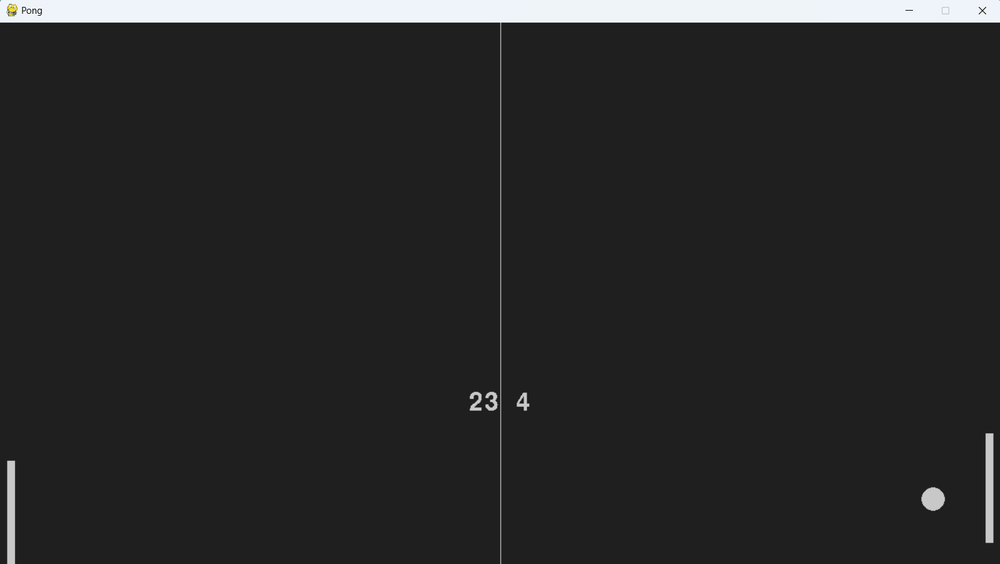

# Pong Game with Q-learning Agent
This is a Python implementation of the classic Pong game, featuring a Q-learning agent that learns to play against an AI player or a human player.

## Installation
To install the required libraries, run the following command:

pip install pygame

pip install matplotlib

pip install numpy

## Usage
To start the game, run the following command:

python main.py

## Game Modes

### Agent RL vs Agent AI
In this mode, the Q-learning agent plays against an AI player. The agent uses the Q-learning algorithm to learn from its actions and improve its performance over time.

### Agent RL vs Human
In this mode, the Q-learning agent plays against a human player. The agent learns from its actions and tries to beat the human player.

### Agent RL vs Agent RL
In this mode, two Q-learning agents play against each other. Both agents learn from their actions and try to beat each other.

## Conclusion
In conclusion, this Pong game with Q-learning agent is a fun and interactive way to learn about reinforcement learning and the Q-learning algorithm. The game allows you to play against an AI player or a human player, or even watch two agents play against each other. The agent's performance can be analyzed using the reward plot, which shows how the agent improves over time.

Enjoy playing!
